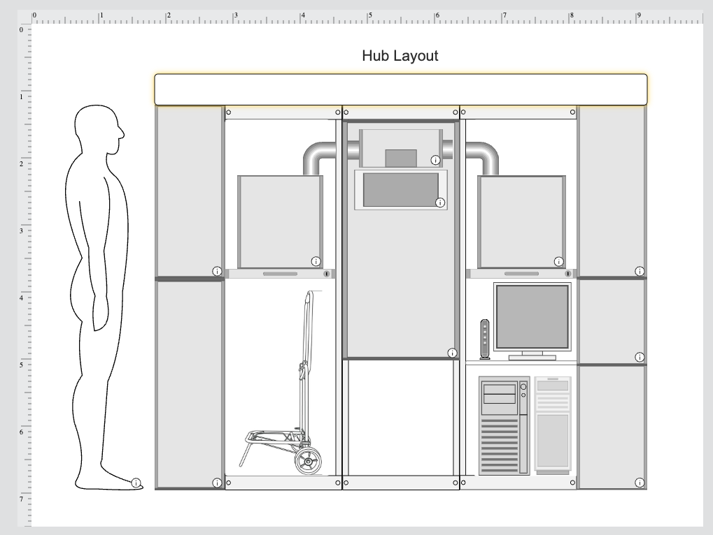
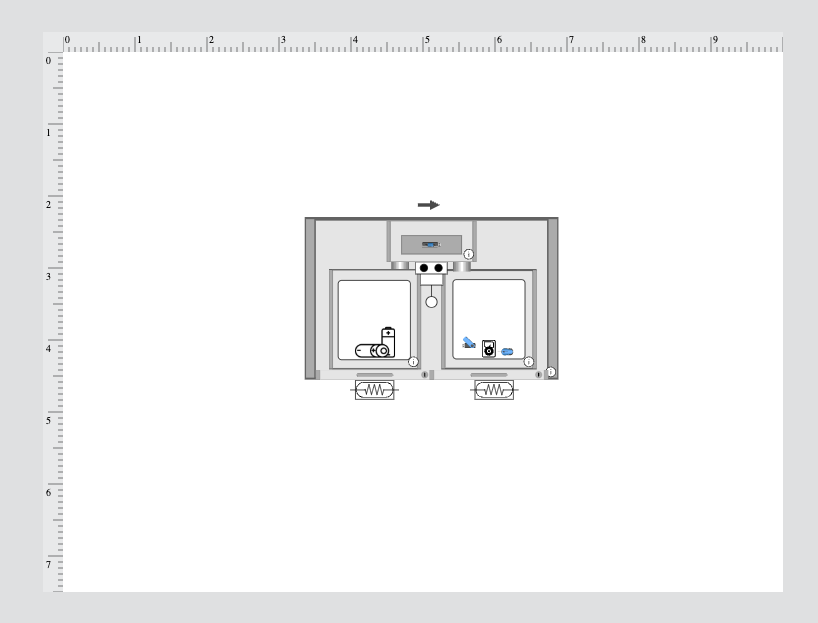

# University of Melbourne E-Waste Sorting Hub
*Team A2*
 

A modular, scalable prototype for promoting responsible e-waste disposal across University of Melbourne campuses. Developed in response to stakeholder feedback, this project aims to simplify the sorting of batteries and e-waste, increase user awareness, and support the university’s **Sustainability Plan 2030** goals for circularity.

## Project Goals

- Increase clarity and accessibility around e-waste disposal.
- Reduce contamination and misuse of e-waste bins.
- Separate battery and general e-waste for safe disposal.
- Align with UoM’s Sustainability Plan 2030: circularity, tracking, and environmental justice.
- Create a **modular**, **low-cost**, and **scalable** solution for deployment across faculties.

## Features
- **Card Activation**: RFID/button-based interaction to begin the sorting process.
- **LCD Instructions**: Real-time visual guidance for users.
- **Battery vs E-Waste Detection**: Selection via button or image classification (future).
- **Conveyor Belt Sorting**: Servo-controlled mechanism separates items.
- **QR Signage & Feedback**: Large visual cues and QR codes linking to instructions.
- **Expandable AI**: Prepared for integration with TensorFlow/YOLOv8 computer vision models for automated classification.

## User Testing Insights
| Stakeholder        | Insight                                                                 |
|--------------------|-------------------------------------------------------------------------|
| TCS & Sustainability | Need for lithium battery handling clarity; e-waste approx. 0.2m³/year. |
| Jobelle (Tech Staff)| Existing collection systems unclear; risks of battery misplacement.     |
| PhD Students/Staff  | Instructions on bins unclear, hard to book disposal support.            |

### Changes from Feedback:
- Improved **signage** and added **images**.
- Enhanced **screen messaging**.
- Designed **rear-access bins** for easy collection (TCP feedback).

## Stakeholders
- **Internal**: Campus Assist, Sustainability Team, TCS, Staff and Students
- **External**: Envirostream, Ecobatt, Cleanaway

## Contents
| File | Description |
|------|-------------|
| `a2_arduino_code_lo_fi.ino` | Arduino sketch controlling sorting logic |
| `tinkercad_schematics.pdf` | Circuit design exported from Tinkercad |
| `tinkercad_1.png` - `tinkercad_4.png` | Views of circuit from Tinkercad |
| `images/01.jpg` - `images/18.jpg` | Photos from prototype, poster, signage |
| `a2_lo_fi_prototype_view_1.png`, `view_2.png` | Lo-fi prototype snapshots |
| `E-waste bin poster.pptx` | Printable awareness poster design |

## Hardware (Lo-Fi Prototype)
- Arduino Uno
- Servo motor (conveyor sorting)
- LCD 16x2 display (parallel)
- Button inputs (card, battery type)
- Power supply & breadboard setup
- Optional: RFID scanner for card-based access

[View Tinkercad Circuit](https://www.tinkercad.com/things/1ucuSc4Ial4/editel?sharecode=mLrZAbDzcxXoekwXmUjWTCLxmmftjxwgGwGp0jVNXQU)

 

## Design Overview

- Card interaction simulates secure user input.
- Battery and e-waste differentiated using user-selected logic (future: camera).
- Conveyor moves item to correct bin using servo.
- Guidance shown via LCD and printed signage.
- Modular enclosure for scale-up.

## Next Proposed Phase: AI
- Trained using Kaggle image dataset for battery/e-waste classification.
- Model deployment using YOLOv8 or TechnoLynx micro-models.
- Potential for gamified user feedback via dashboard.

## Next Steps
- Finalize detection method (camera or button logic).
- Pilot system in one faculty space.
- Test camera-based classification model.
- Improve enclosure for long-term deployment.
- Final deployment guide for university-wide scale-up.

## Future

| Theme | Sample Question | Suggested Answer |
|-------|------------------|------------------|
| Feasibility | Is large-scale rollout realistic? | Yes, due to modularity, low-cost electronics, and adaptable design. |
| Testing | What did you learn from user testing? | Signage improved clarity. Rear-access bin and LCD guidance well-received. |
| Collaboration | How did your team work together? | Regular team voting, feedback on OneDrive, prototyping at Telstra Creator Space. |
| Unknowns | Why did you prototype sorting? | Sorting was the most critical failure point. Focused on battery/e-waste decision logic. |

## Links
- [Miro Board (Project Planning)](https://miro.com/app/board/uXjVIR7Ld8A=/)
- [GitHub Repository](https://github.com/leakydishes/e-waste-uom-hub/)
- [Tinkercad Circuit](https://www.tinkercad.com/things/1ucuSc4Ial4/editel?sharecode=mLrZAbDzcxXoekwXmUjWTCLxmmftjxwgGwGp0jVNXQU)

## License
This project is for educational and research purposes under the University of Melbourne.
