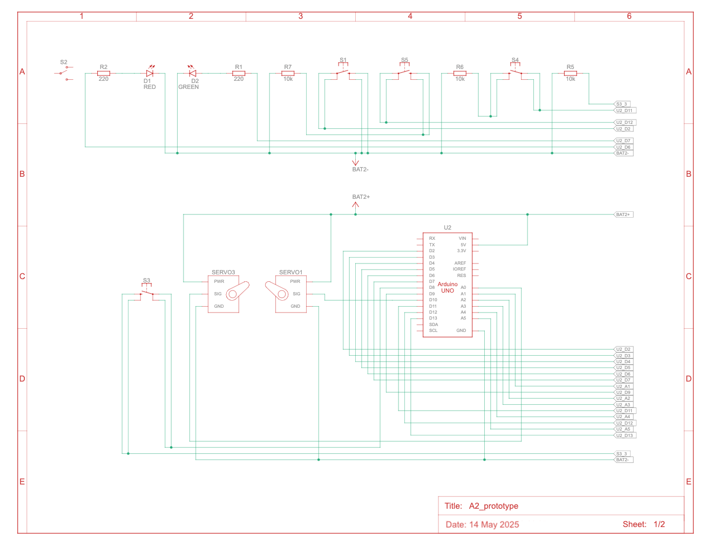
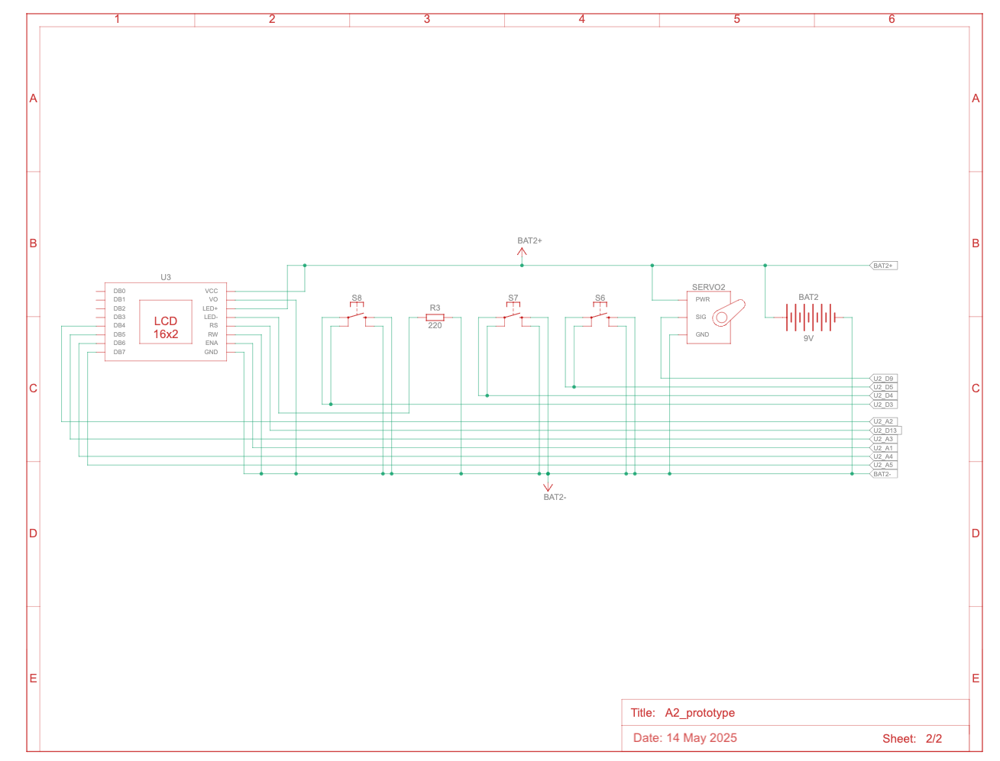
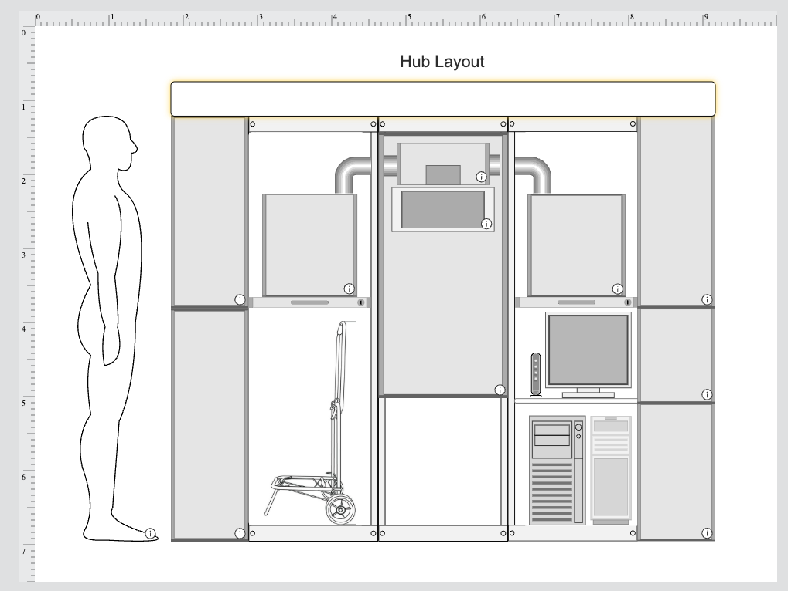
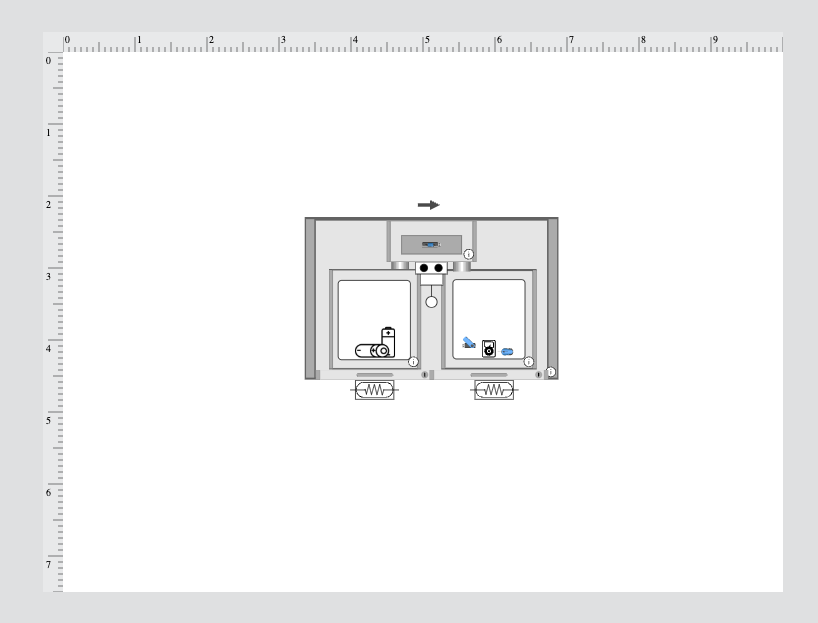
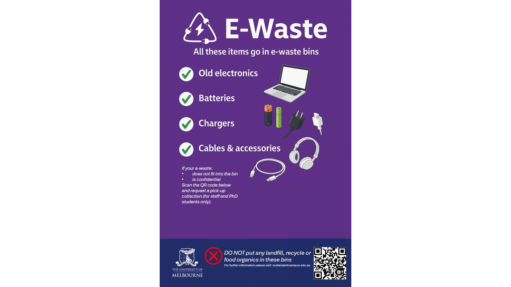
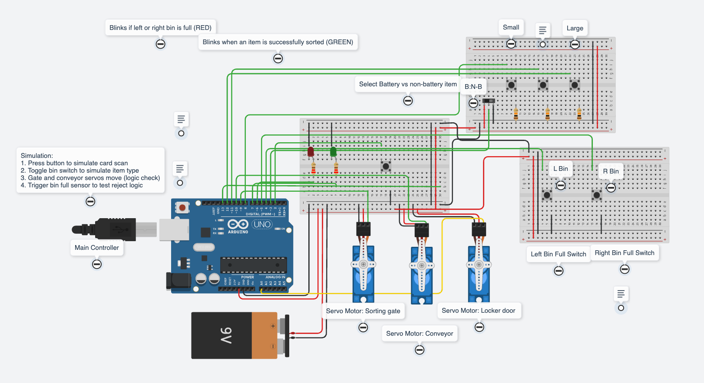
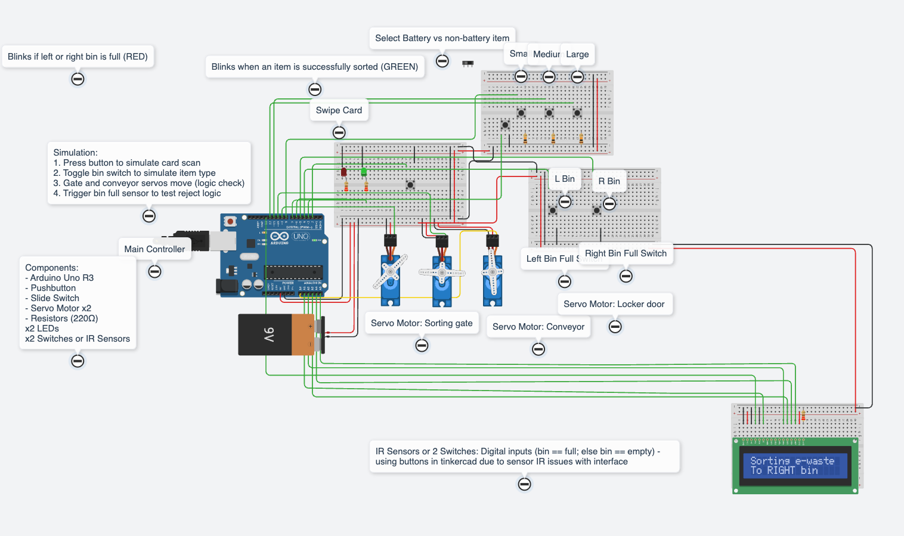
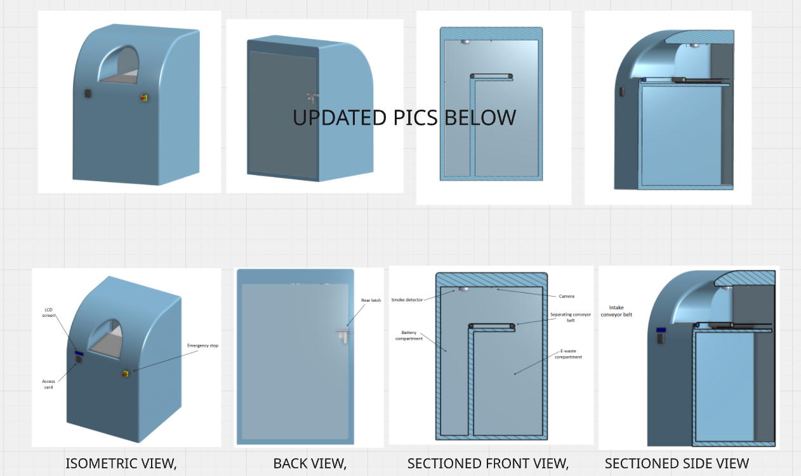
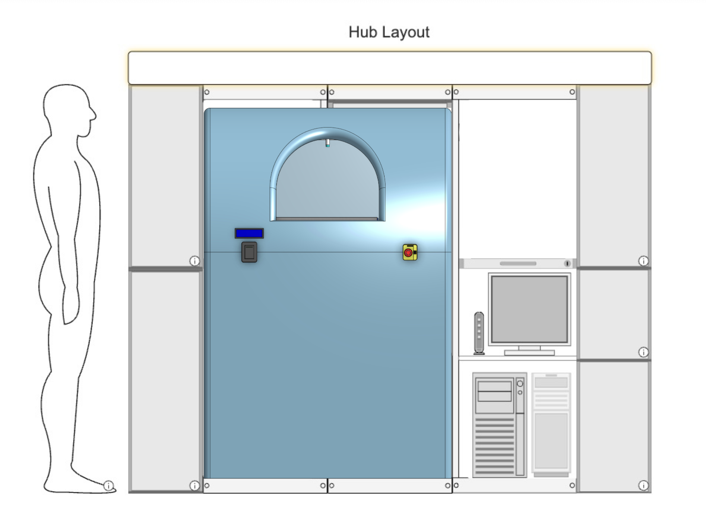

# University of Melbourne E-Waste Sorting Hub
*Team A2 Yangkun Jiao, Ben Simpson, Rishikesh Talwar, Te’ Claire 2025*
 

A modular, scalable prototype for promoting responsible e-waste disposal across University of Melbourne campuses. Developed in response to stakeholder feedback, this project aims to simplify the sorting of batteries and e-waste, increase user awareness, and support the university’s **Sustainability Plan 2030** goals for accessibility and circularity.
[One Drive Storage Data](https://unimelbcloud-my.sharepoint.com/:f:/g/personal/tclaire_student_unimelb_edu_au/EukbrHc8BVZIpEx_mHkipsQB5BqStrm7QtRnd1XLdTR9qQ?e=X5ZUhR)

## Stakeholders
| **Type**   | **Stakeholders**                                                                 |
|------------|-----------------------------------------------------------------------------------|
| **Internal** | Campus Assist, Sustainability Team, Telstra Creator Space (TCS), Staff, PhD Students |
| **External** | Envirostream, Ecobatt, Cleanaway, La Trobe University Staff                    |

## Stakeholder Interview Insights
| **Stakeholder**                   | **Insight**                                                                                                              |
|----------------------------------|--------------------------------------------------------------------------------------------------------------------------|
| UoM Staff – Philip Christopher   | Walked through ServiceNow portal for e-waste ticketing. Found bin instructions unclear and support request process confusing. |
| TCS & Sustainability Team        | Need for lithium battery handling clarity. Estimated e-waste volume: approx. 0.2m³/year.                                   |
| Campus Assist                    | Internal communication between teams is often lacking. Staff are not given sufficient notice.                             |
| Sustainability Team             | Need to increase awareness.                                                                                              |
| Callum (Campus Assist)           | Representative mentioned communication barriers.                                                                         |
| Emilia (Sustainability Team)     | Raised importance of staff awareness and user clarity.                                                                   |
| Nicholas Archon (TCS)            | Shared feedback from testing and prototyping stages.                                                                     |

## Key Observations
- The e-waste disposal request is found under the general Request ticket in UoM's ServiceNow portal, under Cleaning and Waste Disposal.
- Selecting E-waste allows free removal (up to one Ute load) and indicates proper recycling measures and deadlines.
- Confidential disposal (example: hard drives, sensitive documents) is a separate, unclear process for users.
- A map of confidential bins is available, but media like DVDs require special bulk disposal requests, often with faculty charges.
- Guidance for filling out the request is insufficient—existing guides are generic and not step-by-step.
- ServiceNow sends confirmation emails with ticket IDs; staff can track updates via email or the dashboard.

## Challenges identified 
- The system is not intuitive, the team witnessed redundant paths to find the correct service. Additionally, it is unclear with distinctions between services. 
- E-waste is not a top-level category and is buried within broader menus, potentially causing users to miss it. 
- No prompt appears to guide users when confidential items may be included in an E-waste request. 
- The process is confusing and inefficient, especially for average or new staff unfamiliar with the portal structure and ticket request

## Solution  - Modular e-waste hub  
- Increase awareness (E-waste wall hubs in same locations as confidential document bins for staff access), clear visual signage. 
- Unify external Partnerships 
- Support users in correct disposal methods  
- Separating batteries from e-waste collection for safe disposal 
- Alignment with Sustainability Plan 2030 [1] (circularity, tracking) - Interface hub can track / gamify e-waste donation and support circularity.  

## Project Goals
- Increase clarity and accessibility around e-waste disposal.
- Reduce contamination and misuse of e-waste bins.
- Separate battery and general e-waste for safe disposal.
- Align with UoM’s Sustainability Plan 2030: circularity, tracking, and environmental justice.
- Create a **modular**, **low-cost**, and **scalable** solution for deployment across faculties.

## Features
- **Card Activation**: RFID/button-based interaction to begin the sorting process.
- **LCD Instructions**: Real-time visual guidance for users.
- **Battery vs E-Waste Detection**: Selection via button or image classification (future).
- **Conveyor Belt Sorting**: Servo-controlled mechanism separates items.
- **Signage**: Large visual cues and QR codes linking to instructions.
- **Future: AI**: Prepare for integration with TensorFlow/YOLOv8 computer vision models for automated classification.

### Schematics 
| **Schematics Page 1** | **Schematics Page 2** |
|-----------------------------------------|------------------------------------------------------|
|  |  |

 

### Design Overview 
| ** View 1** | ** View 2** |
|-----------------------------------------|------------------------------------------------------|
|  |  |

### Signage
| **Poster placed on Hub for Prototype**
|-----------------------------------------|
|  

 

### Prototype (Digital User Testing Feedback)
| **Original Prototype for User Testing** | **Updated Prototype Based on User Testing Feedback** |
|-----------------------------------------|------------------------------------------------------|
|  |  |

 

### Prototype (CAD and Design Testing Feedback)
| **Updated visuals based on User Testing** | **Updated design Hub for Prototype** |
|-----------------------------------------|------------------------------------------------------|
|  |  |

 

## User Testing Insights
| **Stakeholder**                                                                 | **Insight**                                                                                      | **Changes**                                                    |
|----------------------------------------------------------------------------------|--------------------------------------------------------------------------------------------------|----------------------------------------------------------------|
| Telstra Creator Space (TCS) Staff – Hanming Yang, Simon Le                      | Need for lithium battery handling clarity; approx. 0.2m³/year of e-waste.                        | Designed rear-access bins for easy collection; bin quick-release suggested. |
| Jobelle Aguinaldo (Laboratory Technical Officer – MED)                          | Existing collection systems unclear; risks of battery misplacement.                              | Improved signage and added images. Didn't test, but expressed enthusiasm for visuals. |
| Graduate Researcher & Staff – La Trobe University (M. Corbel)                   | LCD screen is needed to inform users clearly.                                                    | Enhanced screen messaging with LCD interface.                 |

### Changes from Feedback:
- Improved **signage** and added **images**.
- Designed **rear-access bins** for easy collection.  
  - *TCS Feedback*:  
    - Nick: Belt should be tightened.  
    - Simon: Needs quick-release bins.  
    - Grace: "Really good idea."
- Enhanced **LCD screen messaging** for user clarity.

## Hardware Lo-Fi Prototype
- Arduino Uno
- Servo motor (conveyor sorting)
- LCD 16x2 display (parallel)
- Button inputs (card, battery type)
- Power supply & breadboard setup
- Optional: RFID scanner for card-based access

[View Tinkercad Circuit](https://www.tinkercad.com/things/1ucuSc4Ial4/editel?sharecode=mLrZAbDzcxXoekwXmUjWTCLxmmftjxwgGwGp0jVNXQU)

### Presentation – University of Melbourne (UoM)

| **Prototype Step 1**   Tap card to begin | **Prototype Step 2**   Select size: small | **Prototype Step 3**   Battery loaded | **Prototype Step 4**   Battery check |
|--------------------------------------------|---------------------------------------------|------------------------------------------|------------------------------------------|
|  |  |  |  |

| **Prototype Step 5**   Battery check = yes | **Prototype Step 6**   Sorting | **Prototype Step 7**   USB loaded | **Prototype Step 8**   Battery check = no |
|----------------------------------------------|----------------------------------|-------------------------------------|--------------------------------------------|
|  |  |  |  |

| **Prototype Step 9**   Sorting | **Prototype Step 10**   Completed: Points received | **Prototype Step 11**   Select size: medium | **Prototype Step 12**   Locker opened |
|----------------------------------|-------------------------------------------------------|--------------------------------------------|------------------------------------------|
|  |  |  |  |

| **Prototype Step 13**   Locker closed | **Prototype Step 14**   Completed: Points received | **Prototype Step 15**   Select size: large | **Prototype Step 16**   ServiceNow request |
|------------------------------------------|------------------------------------------------------|---------------------------------------------|--------------------------------------------|
|  |  |  |  |

 

 

## Next Proposed Phase: AI
- Trained using Kaggle image dataset for battery/e-waste classification.
- Model deployment using YOLOv8 or TechnoLynx micro-models.
- Potential for gamified user feedback via dashboard.

## Next Steps
- Finalise detection method (camera or button logic).
- Pilot system in one faculty space.
- Test camera-based classification model.
- Improve enclosure for long-term deployment.
- Final deployment guide for university wide scale-up starting in the Melbourne Connect Building Level 4 IT Department

## Future

| **Theme**       | **Sample Question**                    | **Suggested Answer**                                                                                                                                                                                                                                                                                                               |
|-----------------|-----------------------------------------|------------------------------------------------------------------------------------------------------------------------------------------------------------------------------------------------------------------------------------------------------------------------------------------------------------------------------------|
| **Next Steps**  | What’s next to ensure success?          | Finalise detection method (e.g. camera replacing button logic). Improve enclosure design. Pilot with a bin at Melbourne Connect for Faculty of Engineering and Information Technology (FEIT) staff – 700 Swanston St, Carlton VIC 3053 – and Telstra Creator Space at same location. GitHub repository includes code, schematics, and guides. |
| **Feasibility** | Is large-scale rollout realistic?       | Yes, due to modularity, low-cost electronics, and adaptable design.                                                                                                                                                                                                                                                               |
| **Testing**     | What did you learn from user testing?   | Signage improved clarity. Rear-access bin and LCD guidance were well received.                                                                                                                                                                                                                                                  |
| **Collaboration** | How did your team work together?       | Regular team voting and feedback via OneDrive. Prototyping and testing at Telstra Creator Space.                                                                                                                                                                                                                                |
| **Unknowns**    | Why did you prototype sorting?          | Sorting was identified as the most critical failure point. Focused specifically on battery/e-waste decision logic.                                                                                                                                                                                                              |
| **Circularity** | How does this promote circular economy? | Encourages component separation and efficient recovery. Supports data collection for identifying reuse trends. Built upon 2017 UoM waste data study and TCP clean waste reports.                                                                                                                                             |
| **Stakeholders**| Who would manage it post-deployment?    | CampusAssist and the Sustainability Office. Potential partnerships with TCS, Technical Officer Jobelle Aguinaldo, and external e-waste providers. QR code guides help integrate with ServiceNow workflows.                                                                                                                   |

## Links
- [Miro Board (Project Planning)](https://miro.com/app/board/uXjVIR7Ld8A=/)
- [GitHub Repository](https://github.com/leakydishes/e-waste-uom-hub/)
- [Tinkercad Circuit](https://www.tinkercad.com/things/1ucuSc4Ial4/editel?sharecode=mLrZAbDzcxXoekwXmUjWTCLxmmftjxwgGwGp0jVNXQU)

## Additional Information - Evaluation Criteria
### Collection HUB
| **Evaluation Criteria**               | **Weighted** | **Reason**                                                                                                                                               |
|--------------------------------------|--------------|----------------------------------------------------------------------------------------------------------------------------------------------------------|
| **Energy Efficiency**                | 4            | Uses sensors and servo motors efficiently; minimal power use. Manual handling greatly reduced.                                                           |
| **Cost implications**                | 3            | Upfront cost for tech and infrastructure; long-term savings from reduced manual labour and contamination.                                               |
| **Innovation**                       | 5            | Introduces autonomous sorting, gamification, QR-code integration, and real-time bin tracking.                                                           |
| **Awareness (easily noticeable)**    | 4            | Highly visible portal with clear signage, screen prompts, and QR codes; improves awareness campus-wide.                                                 |
| **Ease of implementation**           | 3            | Moderate complexity due to sensors, card system, and ServiceNow integration. Feasible with planning.                                                    |
| **Impact / effectiveness**           | 4            | Encourages high engagement via confetti, rewards, and feedback; sorts waste accurately and securely.                                                    |
| **Effectiveness of External Partnerships** | 3      | Partners with external battery collectors; potential to expand to other recyclers or circular providers.                                                |
| **Impact of Accessibility**          | 4            | Accessible interface, card scanner, guided steps, visual cues, and inclusive user flow.                                                                 |
| **Potential for circularity**        | 4            | Tracks reuse/donation, avoids contamination, supports data collection and transparency.                                                                 |
| **Maintenance and Support**          | 3            | Needs servicing for bins and tech; sensor alerts help minimize downtime.                                                                                |
| **Time commitment (training)**       | 4            | Minimal training required; system guides users with step-by-step instructions and automation.                                                           |

---

| **Weighted Total (+)** | **Weighted Total (-)** | **Final Score** |
|------------------------|------------------------|-----------------|
| 41                     | 0                      | **41**          |

## References
1. [University of Melbourne Sustainability Report – Just and Circular Economy](https://www.unimelb.edu.au/sustainabilityreport/domain-3-walking-the-talk-in-our-operations/just-and-circular-economy)
2. [Pavan Sanagapati – Images Dataset on Kaggle](https://www.kaggle.com/datasets/pavansanagapati/images-dataset)
3. [Technolynx – Streamlining Sorting and Counting Processes with AI](https://www.technolynx.com/post/streamlining-sorting-and-counting-processes-with-ai)
4. [University of Melbourne – Pursuit Article: Reduce, Reuse and Recycle for a Circular Economy](https://pursuit.unimelb.edu.au/articles/reduce-reuse-and-recycle-for-a-circular-economy)
5. [ScienceDirect – Drivers, Barriers and Strategies for Circular Economy Implementation](https://www.sciencedirect.com/science/article/abs/pii/S0921344919305385?via%3Dihub)
6. [ScienceDirect – Circular Economy and Artificial Intelligence Integration](https://www.sciencedirect.com/science/article/abs/pii/S0959652623015548)

## License
This project is for educational and research purposes under the University of Melbourne.
